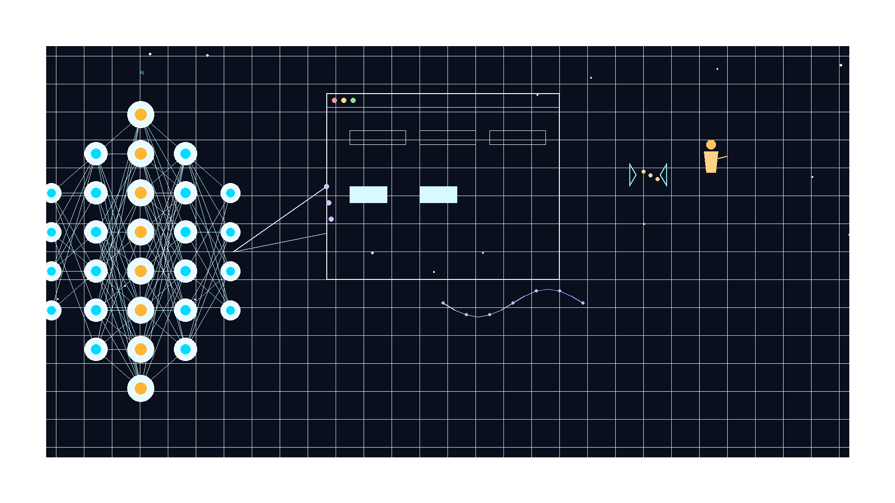
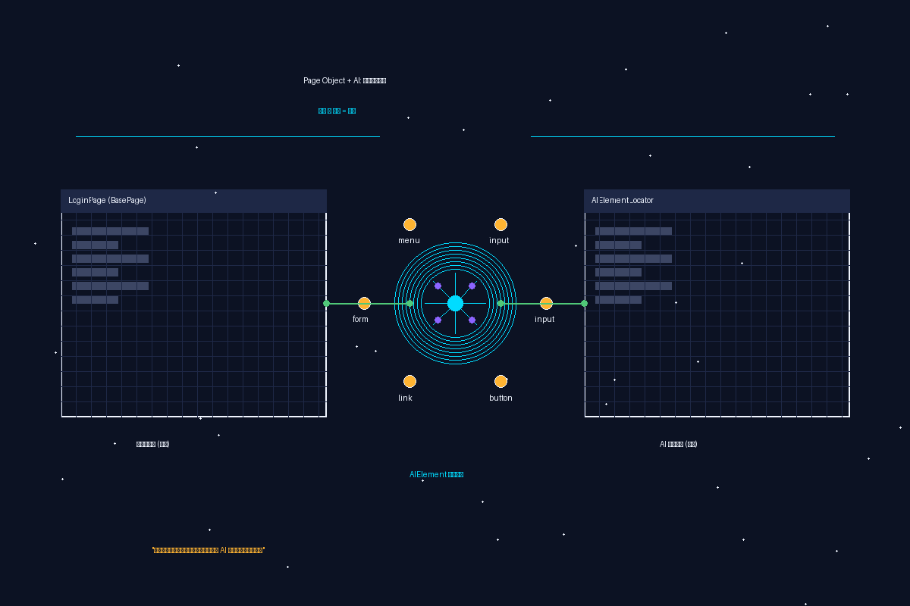
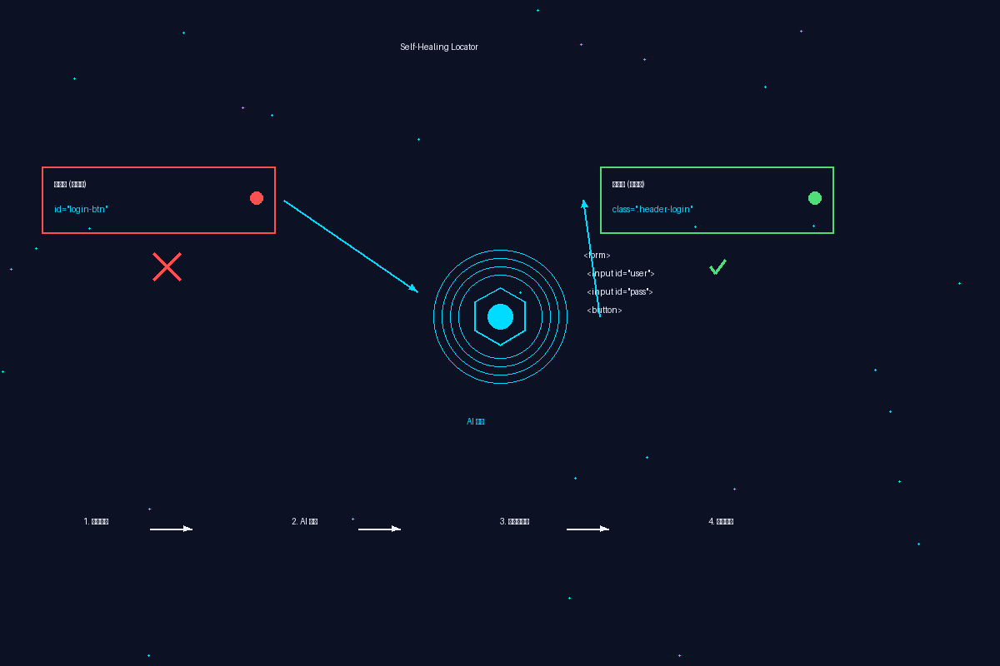
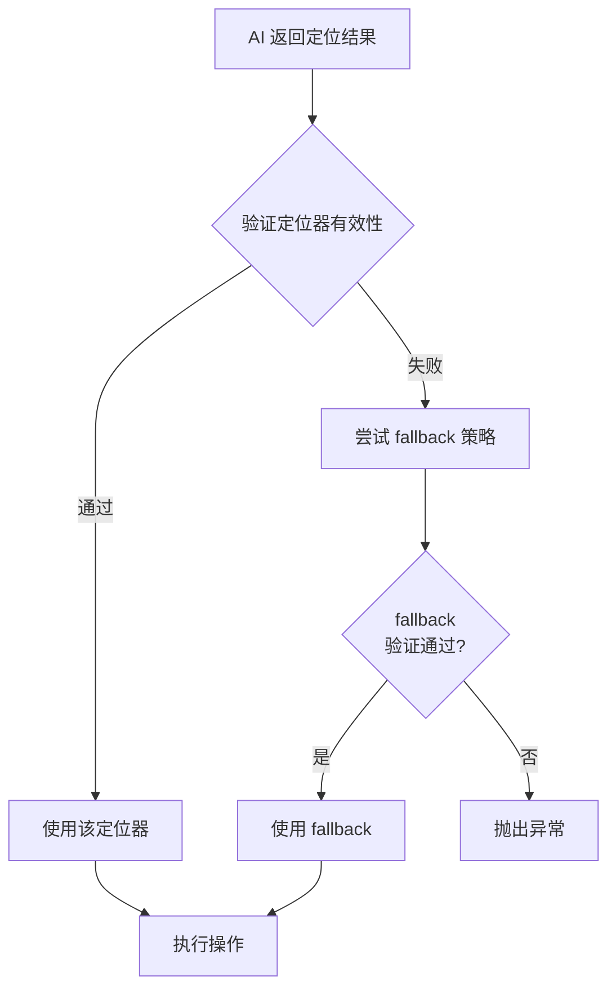
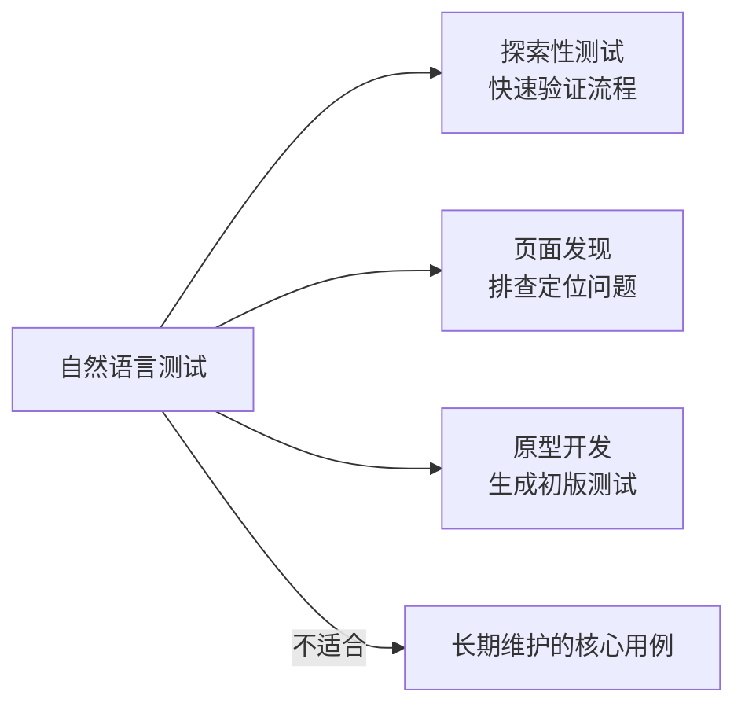
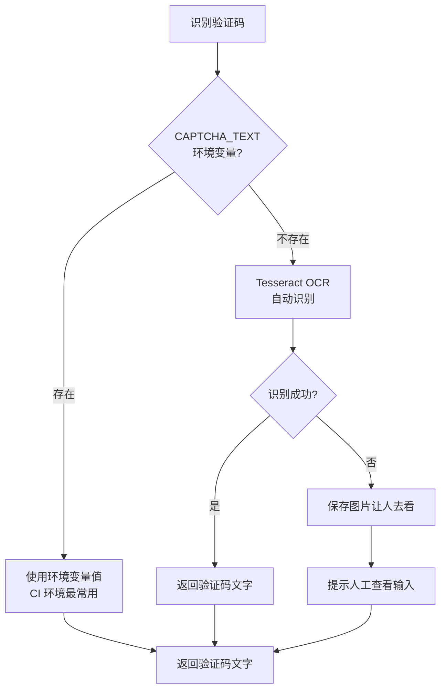
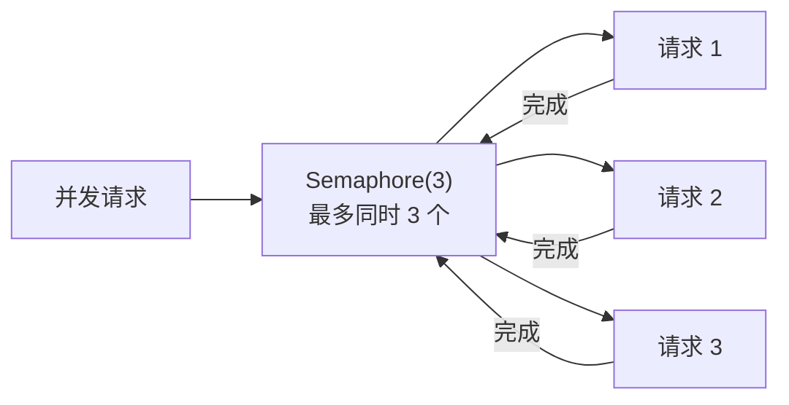

# AI 驱动 Selenium 自动化测试：来自一线实践的最佳实践



用 AI 大模型来做 Web 自动化测试这件事，我已经跑了将近两年。从最开始的概念验证，到后来真刀真枪地用到生产项目里，踩过的坑比走过的路还多。

这篇文章不打算复述什么"AI 将改变测试行业"这种正确的废话。我只想把在这套框架开发和落地过程中真正管用的经验整理出来，供大家参考。

---

## 为什么 AI + Selenium 是值得做的组合

Selenium 大家都在用，痛点也都知道——元素定位器太脆了。前端改个 ID，加个动态类名，原来能跑的用例说挂就挂。一个页面几十个元素，维护成本蹭蹭往上涨。

传统解法是建立元素仓库、制定定位规范、加上显式的等待。但这些都没解决根本问题：前端和测试是两条独立迭代的线，总有对不上的地方。

AI 的出现给这个问题提供了一个新思路：当定位失败时，让模型去"理解"页面结构，自己推断出新的定位方式。这不是要替代 Page Object，而是给 Page Object 加一层弹性。

框架核心能力有三个：

- **AI 元素定位**：传统方式找不到时，用 LLM 分析 HTML，返回语义化的定位建议。
- **自愈引擎**：定位器断掉后自动尝试修复，高置信度时自动采纳，低置信度时标记待审核。
- **自然语言生成**：说一句话描述操作，框架自动生成可执行的测试代码。

---

## 最佳实践一：Page Object 模式不要丢，AI 是补充不是替代



有些人以为上了 AI 就可以不写 Page Object 了，这是误区。

Page Object 最大的价值不是定位器本身，而是把页面结构和测试代码解耦。如果完全依赖 AI 定位，每次运行时都要调用 API，成本高且不稳定。

正确的做法是：**先用传统定位器写死稳定的部分，再用 AI 补齐容易变化的部分**。

```python
class LoginPage(BasePage):
    # 优先用稳定的 placeholder 属性
    @property
    def email_input(self):
        return self.element(
            "邮箱输入框",
            locator=(By.CSS_SELECTOR, 'input[placeholder="邮箱"]'),
        )

    # 没有稳定属性时，用 AI 语义定位
    @property
    def login_button(self):
        return self.element("登录按钮")
```

这个原则在团队协作时尤其重要。测试人员写用例时还是按照 Page Object 的方式定义元素，AI 在底层默默地提供兜底能力，大家各干各的，互不依赖。

---

## 最佳实践二：设计良好的元素语义描述

AI 定位的核心在于"语义描述"。描述越准确，模型返回的结果越好。

反例：`input1`、`button2` 这种没有语义的名称，模型根本不知道你要找什么。

正例：`"登录按钮"`，模型能理解这是一个可交互的提交类元素。

在实际项目中，我们总结出一套描述规范：

```python
# 表单元素：类型 + 名称
"用户名输入框"
"密码输入框"
"验证码输入框"

# 按钮：动作 + 对象
"登录按钮"
"提交按钮"
"取消按钮"
"删除确认按钮"

# 链接/导航
"用户中心链接"
"帮助中心链接"

# 特定区域
"搜索结果列表"
"错误提示信息"
"分页控件"
```

如果页面元素很多，可以加上页面上下文：

```python
"登录表单的用户名输入框"
"搜索结果页的下一页按钮"
```

---

## 最佳实践三：自愈阈值要合理设置，不要盲目追求自动化



自愈引擎的 `auto_approve_threshold` 默认是 0.85。这个数字不是拍脑袋的，是经过一段时间调试后的经验值。

阈值太高：几乎所有自愈都需要人工审核，框架形同虚设。

阈值太低：错误的定位器被自动采纳，用例看着通过了但实际在跑错误的东西。

我建议新项目先用 0.85，观察一段时间的 healing_log，看看有哪些元素是反复自愈的。对于那些结构相对稳定的元素（如导航栏、页脚），可以适当降低阈值；对于动态内容区域（弹窗、浮层），建议保持较高阈值。

```python
# 稳定元素，可适当提高自动采纳率
HealEngine(
    enabled=True,
    auto_approve_threshold=0.80,  # 结构稳定的区域
)

# 动态区域，保持谨慎
HealEngine(
    enabled=True,
    auto_approve_threshold=0.90,  # 频繁改动的区域
)
```

---

## 最佳实践四：AI 定位结果要验证，不要裸用

AI 返回的定位器在使用前一定要验证有效性。我见过有人直接拿 AI 的输出去 `find_element`，然后抱怨框架不稳定——问题在于 AI 也会犯错。

框架内置的验证逻辑是：



这条原则同样适用于 AI 生成的测试代码。生成后先跑一遍，观察有没有误判的元素，有的话就手动修正一下定位器，让 AI 记住这个 pattern。

---

## 最佳实践五：合理使用缓存，避免重复调用

AI 定位是有成本的。一个页面可能调用好几次 AI（每个元素一次），如果不加控制，API 消耗会很快。

框架内置了定位结果缓存：

```python
cache_key = f"{element_desc}|{url}"

if use_cache and cache_key in self._cache:
    return self._cache[cache_key]  # 命中缓存
```

但缓存也要小心使用。SPA 页面 URL 不变但 DOM 变了，这时候缓存会给出错误结果。建议在页面有实质性刷新操作后主动清缓存：

```python
# 页面跳转后清缓存
driver.get(new_url)
ai_locator._cache.clear()
```

对于稳定的列表页、详情页，缓存效果很好。对于动态刷新的页面，保守一点，关闭缓存或缩短缓存周期。

---

## 最佳实践六：自然语言测试适合探索，不适合核心用例

自然语言生成功能很酷，一句"打开百度，搜索AI测试"就能自动生成一套测试代码。但我跑了这么久下来，感觉它最适合的场景是：



**探索性测试**：快速验证某个流程能不能跑通，不需要长期维护。

**页面发现**：给一个 URL，让 AI 分析页面结构，排查定位问题。

**原型开发**：新项目早期，用自然语言快速生成初版测试，后续再按规范重构。

对于真正需要长期维护的核心测试用例，还是老老实实写 Page Object + pytest。生成出来的代码虽然能跑，但缺乏结构化，参数化、数据驱动这些能力都没有，用久了会很痛苦。

一个经验是：把自然语言测试当作"一次性工具"用，用完就丢，不要把它当作主要测试手段。

---

## 最佳实践七：验证码处理要有降级策略

验证码是登录类测试的老大难问题。我的处理思路是降级策略：



CI 环境里一般通过外部系统预先注入验证码，直接用环境变量传进来就行。手动测试时如果 OCR 识别率低，就让程序把图片保存下来，人看一眼再继续。

---

## 最佳实践八：并发执行要注意隔离

跑并行测试时，自愈日志写文件和元素仓库更新文件可能会冲突。要么加锁，要么让每个 worker 写自己的日志目录。

框架默认把日志写入同一个目录，高并发时需要改成：

```python
# 每个 worker 用独立的日志文件
log_path = Path(f"element_repository/logs/worker_{worker_id}/healing_log.jsonl")
log_path.parent.mkdir(parents=True, exist_ok=True)
```

另外一个隔离点是 AI 请求本身。并发太高会导致 API 限流，建议用信号量控制同时进行的 AI 请求数量：



```python
import asyncio

semaphore = asyncio.Semaphore(3)  # 最多同时 3 个请求

async def locate_with_limit(...):
    async with semaphore:
        return await ai_locator.locate(...)
```

---

## 写在最后

AI + Selenium 这条路还在走，框架本身也还有很多要完善的地方。比如当前的自愈还是被动的——要等到定位失败了才去修复。理想的状态应该是能主动预测哪些定位器可能失效，提前给出预警。

但即便在当前阶段，这套框架已经能显著降低维护成本。元素定位相关的 flaky test 减少了大概七成左右，这个数字是让我愿意继续投入的原因。

有同学问这套框架适不适合直接用在生产项目。我的建议是：先拿它跑一跑探索性测试和回归测试，看看 AI 定位的准确率能不能接受，再决定要不要深度集成。每个项目的页面结构复杂度不同，效果会有差异。

代码已经开源，有兴趣可以看看：https://gitee.com/burebaobao/ai-selenium-framework

---

**相关文档**：

- [Code Wiki](CODE_WIKI.md) - 框架完整技术文档
- [项目 README](README.md) - 快速开始指南
