# AI + Selenium Web 自动化测试框架 Code Wiki

## 项目概述

这是一个将大语言模型与 Selenium 结合的前端自动化测试框架，用 AI 驱动元素定位，Selenium 作为执行引擎，pytest 作为测试框架。核心目标是解决传统 Web 自动化中元素定位脆弱、维护成本高的问题。

---

## 技术架构

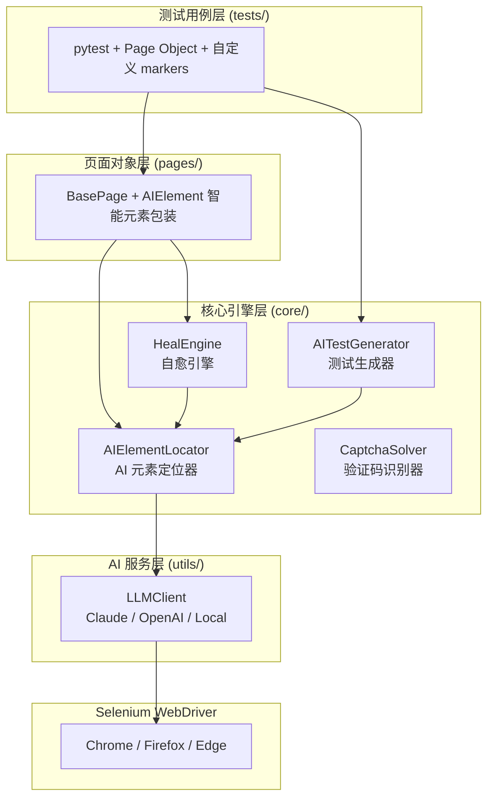

---

## 目录结构

```mermaid
graph TD
    root["ai-selenium-framework/"]
    root --> core["core/"]
    root --> pages["pages/"]
    root --> tests["tests/"]
    root --> utils["utils/"]
    root --> config["config/"]
    root --> elemRepo["element_repository/"]
    root --> scripts["scripts/"]
    root --> reports["reports/"]
    root --> req["requirements.txt"]

    core --> ai_loc["ai_locator.py"]
    core --> heal["heal_engine.py"]
    core --> driver_f["driver_factory.py"]
    core --> ai_gen["ai_generator.py"]
    core --> captcha["captcha_solver.py"]

    pages --> base["base_page.py"]
    pages --> login["login_page.py"]
    pages --> ai_gen_pages["ai_generated/"]

    tests --> conftest["conftest.py"]
    tests --> test_login["test_login.py"]
    tests --> ai_gen_tests["ai_generated/"]

    utils --> ai_client["ai_client.py"]
    utils --> logger["logger.py"]

    config --> settings["settings.py"]
    config --> config_yaml["config.yaml"]

    elemRepo --> elements_yaml["elements.yaml"]
    elemRepo --> healing_log["healing_log.jsonl"]

    scripts --> run_nl["run_nl_test.py"]

    reports --> screenshots["screenshots/"]
    reports --> captcha_rep["captcha/"]
    reports --> allure["allure-results/"]
```

---

## 核心模块详解

### 1. AIElementLocator (`core/ai_locator.py`)

**职责**：当传统 `find_element` 失败时，用 LLM 分析页面 HTML，返回最佳定位策略。

**定位流程**：

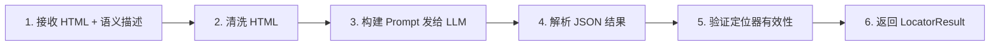

**关键类**：

```python
@dataclass
class LocatorResult:
    found: bool                           # 是否找到
    locator_type: LocatorType            # 定位类型 (css_selector/xpath/text/...)
    locator_value: str                    # 定位表达式
    confidence: float                     # 置信度 0.0~1.0
    reasoning: str                        # 选择理由
    fallback_strategies: list[dict]      # 备选方案

class AIElementLocator:
    async def locate(page_source, element_desc, url) -> LocatorResult
    def discover_element(driver, url, element_desc) -> LocatorResult  # 交互式发现
    def discover_multiple(driver, url, elements) -> dict              # 批量发现
```

**支持的定位类型**：
- `css_selector` - CSS 选择器
- `xpath` - XPath 表达式
- `text` - 文本内容定位
- `aria_label` - ARIA 属性
- `id` / `name` / `class_name`

---

### 2. HealEngine (`core/heal_engine.py`)

**职责**：自愈引擎，当定位器断掉时自动修复。

**工作流程**：

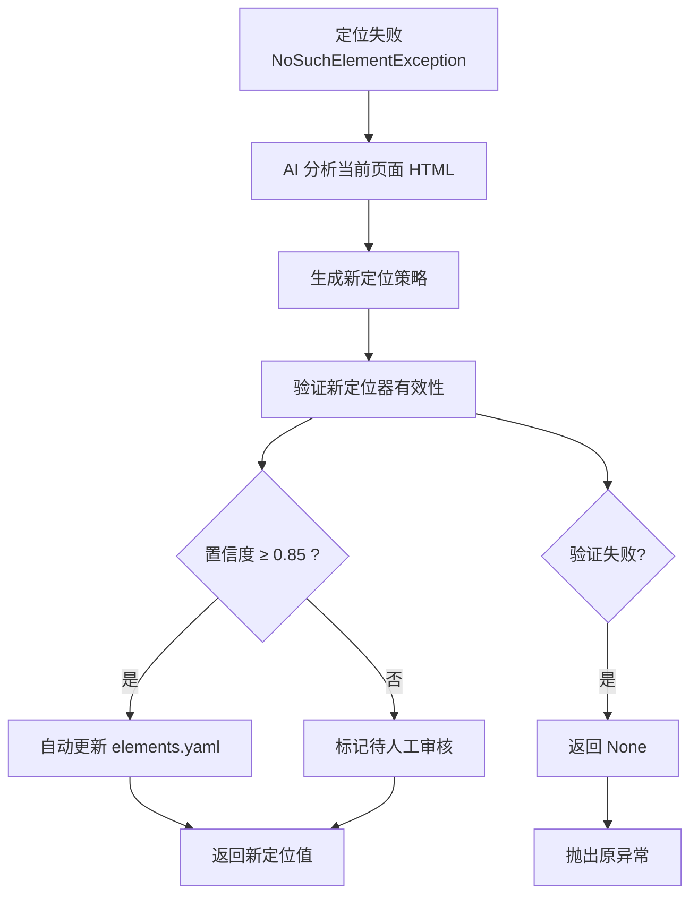

**核心方法**：

```python
class HealEngine:
    def heal(driver, by, old_value, page_source) -> str | None
        # 返回新定位值，或 None 表示自愈失败

    def _verify_locator(driver, locator_type, locator_value) -> bool
        # 验证定位器能否找到元素

    def _update_repository(desc, locator_type, locator_value)
        # 写入 elements.yaml

    def _log_healing(**kwargs)
        # 追加到 healing_log.jsonl
```

---

### 3. AIElement (`pages/base_page.py`)

**职责**：智能元素包装器，封装定位逻辑和操作方法。

**核心逻辑**：

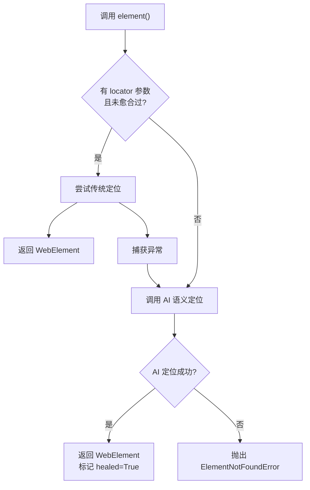

**用法示例**：
```python
# 传统 + AI 回退
self.element("登录按钮", locator=(By.ID, "login-btn")).click()

# 纯 AI 定位
self.element("搜索输入框").input("AI测试")
```

---

### 4. BasePage (`pages/base_page.py`)

**职责**：所有 Page Object 的基类，提供通用方法。

**核心方法**：

```python
class BasePage:
    url: str = ""                    # 页面 URL

    def element(description, locator=None) -> AIElement
        # 创建 AI 智能元素

    def open(url="") -> BasePage
        # 打开页面

    def wait_for_page_loaded(timeout=15) -> BasePage
        # 等待 document.readyState == "complete"

    def take_screenshot(name="") -> str
        # 截图保存到 reports/screenshots/
```

---

### 5. LLMClient (`utils/ai_client.py`)

**职责**：统一封装 Claude / OpenAI / Local (Ollama) 三种 LLM 调用方式。

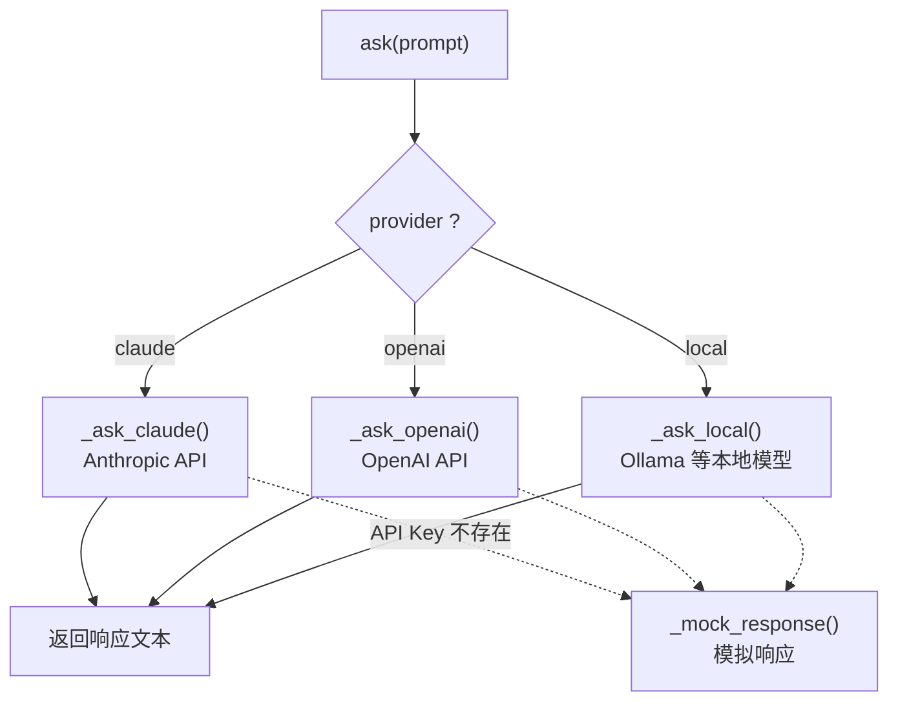

**关键方法**：

```python
class LLMClient:
    async def ask(prompt, response_model=None) -> str
        # 统一入口

    async def _ask_claude(prompt) -> str    # Anthropic API
    async def _ask_openai(prompt) -> str     # OpenAI API
    async def _ask_local(prompt) -> str      # Ollama 等本地模型

    def _mock_response(prompt) -> str
        # 无 API Key 时返回模拟结果，用于开发调试
```

---

### 6. AITestGenerator (`core/ai_generator.py`)

**职责**：将自然语言描述转换为可执行的 pytest 测试代码。

**生成流程**：

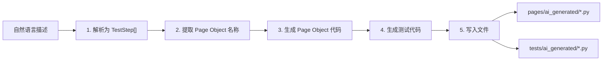

**关键数据结构**：

```python
@dataclass
class TestStep:
    action: ActionType      # open/click/type/assert_text/...
    element_desc: str       # 元素语义描述
    value: str             # 输入值 / 断言值
    locator: tuple | None  # 可选的传统定位器

@dataclass
class GeneratedTest:
    filepath: str           # 测试文件路径
    test_code: str         # 测试代码
    page_object_code: str  # Page Object 代码
    steps: list[TestStep]  # 步骤列表
    page_object_name: str  # PO 类名
```

---

### 7. DriverFactory (`core/driver_factory.py`)

**职责**：创建 WebDriver 实例，支持多浏览器和远程模式。

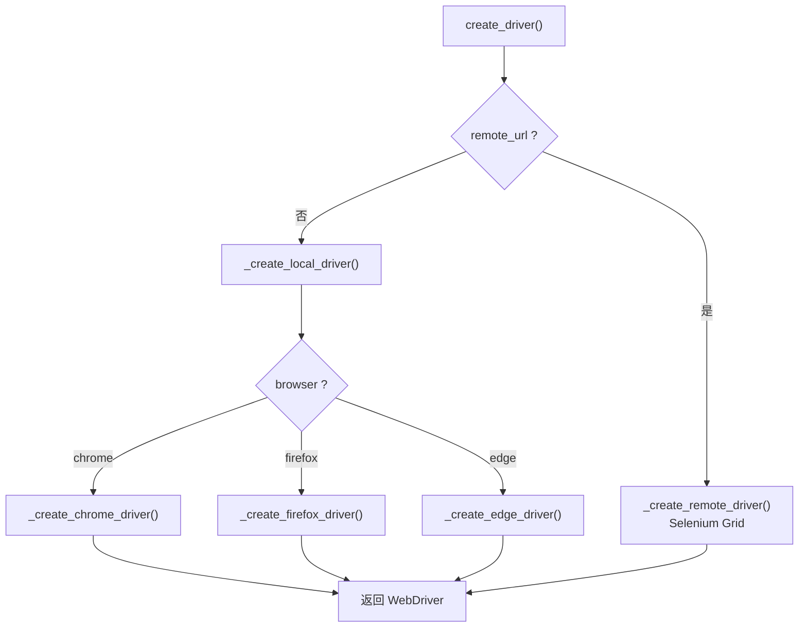

**支持的浏览器**：
- Chrome (需要 ChromeDriver，通过 webdriver-manager 自动管理)
- Firefox (需要 GeckoDriver)
- Edge (需要 EdgeChromiumDriver)

---

### 8. CaptchaSolver (`core/captcha_solver.py`)

**职责**：验证码自动识别。

**识别策略**：

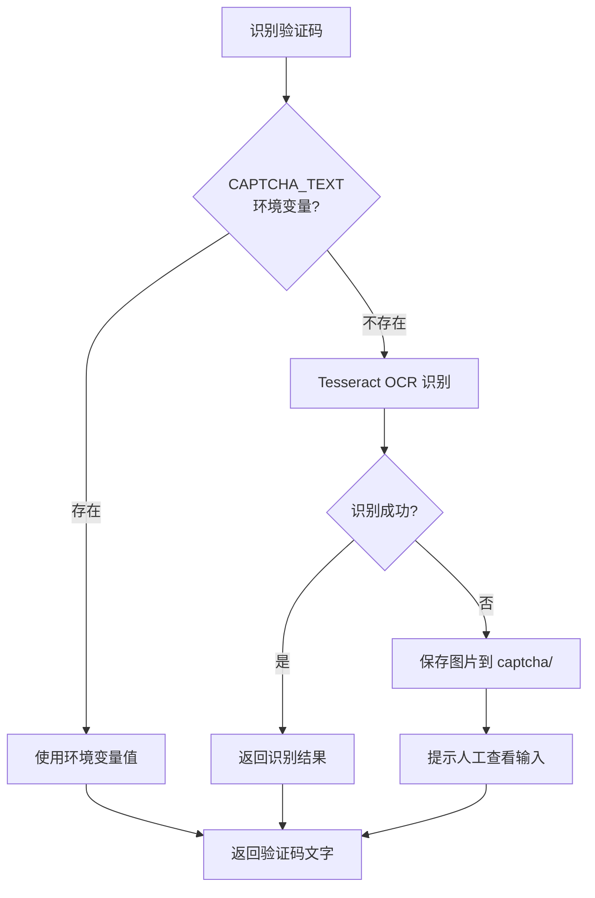

---

## 依赖关系

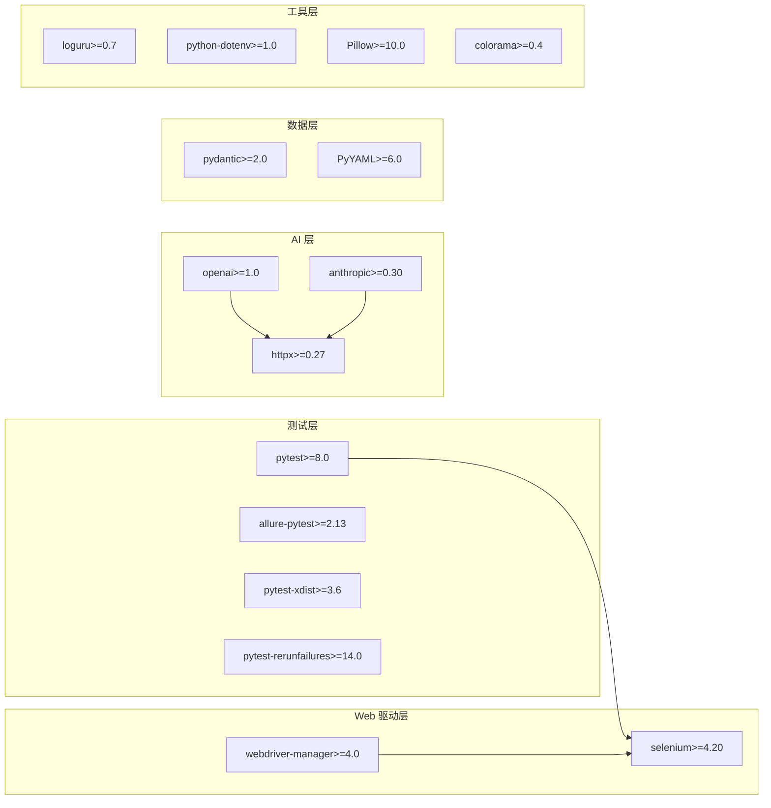

---

## 配置管理

### 环境变量 (`.env`)

```bash
# AI 配置
AI_PROVIDER=claude                              # claude / openai / local
ANTHROPIC_API_KEY=sk-ant-xxxxx
OPENAI_API_KEY=sk-xxxxx
LOCAL_MODEL_URL=http://localhost:11434/v1
LOCAL_MODEL_NAME=qwen2.5:7b

# 浏览器配置
BROWSER=chrome
HEADLESS=false

# 验证码
CAPTCHA_TEXT=xxx
CAPTCHA_ID=xxx
```

### pytest 命令行参数

| 参数 | 说明 | 默认值 |
|------|------|--------|
| `--browser` | 浏览器类型 | `chrome` |
| `--headless` | 无头模式 | `false` |
| `--ai-heal` | 启用 AI 自愈 | `true` |
| `--no-ai-heal` | 禁用 AI 自愈 | - |
| `--ai-provider` | AI 供应商 | `claude` |

---

## 运行方式

### 运行所有测试
```bash
pytest tests/
```

### 指定浏览器
```bash
pytest tests/ --browser chrome
pytest tests/ --browser firefox
pytest tests/ --browser edge
```

### 无头模式
```bash
pytest tests/ --headless
```

### 并行执行
```bash
pytest tests/ -n 4
```

### 失败重试
```bash
pytest tests/ --reruns 2 --reruns-delay 3
```

### 自然语言测试
```bash
# 发现元素
python scripts/run_nl_test.py --discover "https://www.baidu.com" "搜索输入框,百度一下按钮"

# 一句话执行
python scripts/run_nl_test.py "打开百度，输入AI测试，点击搜索"
```

---

## 自愈元素仓库

### `element_repository/elements.yaml`

```yaml
elements:
  登录按钮:
    description: 登录按钮
    locators:
      - type: css_selector
        value: .login-btn
        priority: 1
        status: auto_approved
        added_at: "2026-06-10T21:00:00"
```

### `element_repository/healing_log.jsonl`

```jsonl
{"timestamp": "2026-06-10T21:00:00", "old_by": "id", "old_value": "login-btn", "new_type": "css_selector", "new_value": ".header-login-button", "confidence": 0.95, "reasoning": "ID 变更"}
```

---

## 扩展自定义 Markers

```python
# conftest.py
def pytest_configure(config):
    config.addinivalue_line("markers", "smoke: 冒烟测试")
    config.addinivalue_line("markers", "regression: 回归测试")
    config.addinivalue_line("markers", "ai_generated: AI 自动生成")
    config.addinivalue_line("markers", "healed: 经过自愈的用例")
    config.addinivalue_line("markers", "manual_captcha: 需要手动验证码")
```

---

## CI/CD 集成

### GitHub Actions

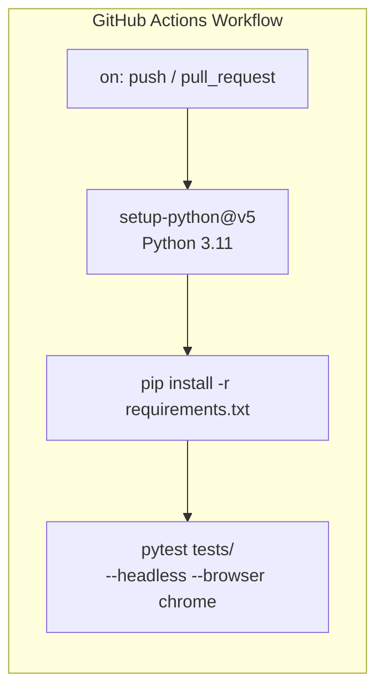

```yaml
name: UI Tests
on: [push, pull_request]
jobs:
  test:
    runs-on: ubuntu-latest
    steps:
      - uses: actions/checkout@v4
      - uses: actions/setup-python@v5
        with:
          python-version: "3.11"
      - run: pip install -r requirements.txt
      - run: pytest tests/ --headless --browser chrome
```

---

## 快速开始

```bash
# 1. 克隆项目
git clone https://gitee.com/burebaobao/ai-selenium-framework.git
cd ai-selenium-framework

# 2. 创建虚拟环境
python3 -m venv .venv
source .venv/bin/activate

# 3. 安装依赖
pip install -r requirements.txt

# 4. 运行测试
pytest tests/ -v --headless

# 5. 自然语言测试
python scripts/run_nl_test.py --discover "https://www.baidu.com" "搜索输入框,百度一下按钮"
```
