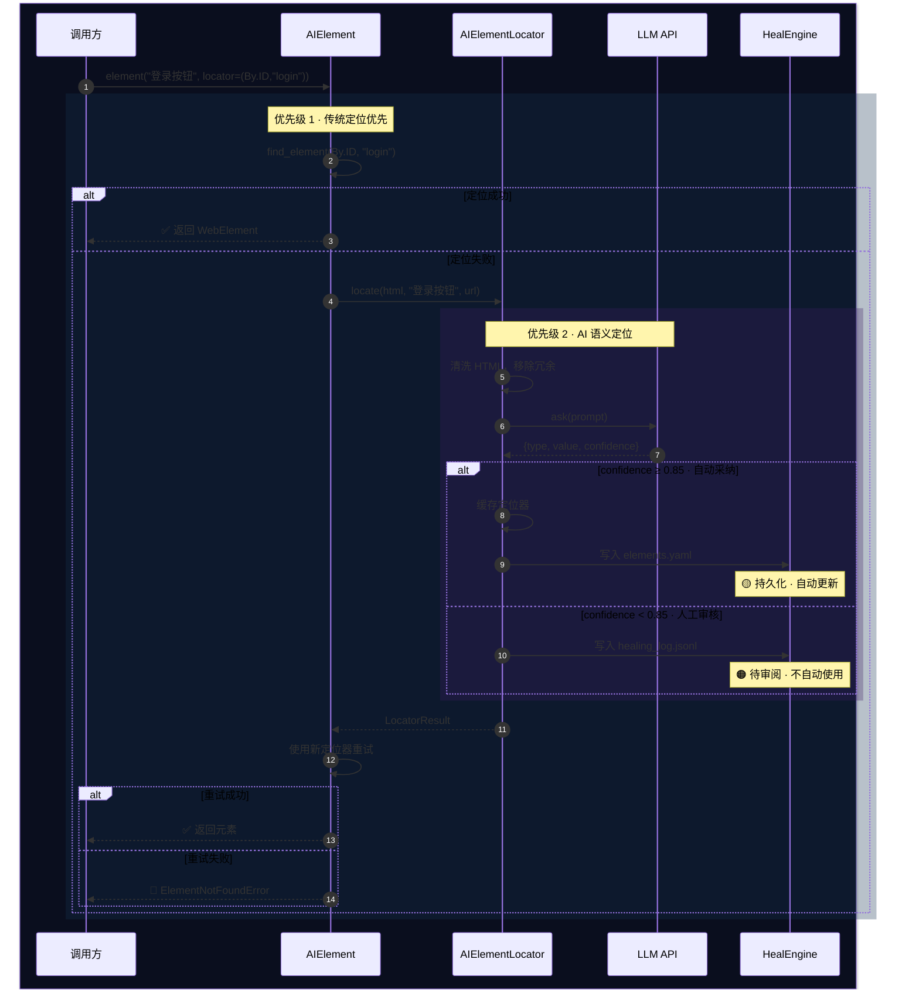

```mermaid
%%{init: {
  "theme": "dark",
  "themeVariables": {
    "primaryColor": "#1a1a2e",
    "primaryTextColor": "#e0e0e0",
    "primaryBorderColor": "#4a9eff",
    "lineColor": "#4a9eff",
    "secondaryColor": "#16213e",
    "tertiaryColor": "#0f0f23",
    "noteBkgColor": "#1e3a5f",
    "noteTextColor": "#ffffff",
    "actorBkg": "#1a1a2e",
    "actorBorder": "#4a9eff",
    "actorTextColor": "#ffffff",
    "signalColor": "#00d4ff",
    "signalTextColor": "#e0e0e0",
    "sequenceNumberColor": "#0f0f23"
  }
}}%%
flowchart LR
    start(("🔵 用户请求元素")) --> q1{"是否有显式<br/>定位器?"}

    q1 -->|"有 locator"| t1[/尝试传统定位<br/>find_element(by,value)/]
    t1 --> q2{定位<br/>成功?}
    q2 -->|"✅ 成功"| done(("🟢 返回元素"))

    q1 -->|"无 locator"| ai1
    q2 -->|"❌ 失败"| ai1
    ai1[/1. 获取页面 HTML/]
    ai1 --> ai2[/2. 构建 Prompt/]
    ai2 --> ai3[/3. 发送 LLM/]
    ai3 --> ai4[/4. 解析 confidence/]
    ai4 --> q3{confidence<br/>≥ 0.85?}

    q3 -->|"✅ 高置信度"| action1[/缓存定位器/]
    action1 --> action2[/写入 elements.yaml/]
    action2 --> retry[/使用新定位器<br/>重试/]

    q3 -->|"⚠️ 低置信度"| warn1[/记录 healing_log/]
    warn1 --> retry

    retry --> q4{重试<br/>成功?}
    q4 -->|"✅"| done
    q4 -->|"❌"| fail(("🔴 抛出异常"))

    classDef se fill:#0f1923,stroke:#00d4ff,stroke-width:3px,color:#00d4ff
    classDef dec fill:#1e3a5f,stroke:#ffb800,stroke-width:2px,color:#fff
    classDef proc fill:#1a1a2e,stroke:#4a9eff,stroke-width:2px,color:#e0e0e0
    classDef succ fill:#0f2a1a,stroke:#00ff88,stroke-width:3px,color:#00ff88
    classDef err fill:#2a0f0f,stroke:#ff4444,stroke-width:3px,color:#ff4444
    classDef ai fill:#1a1a2e,stroke:#a855f7,stroke-width:2px,color:#e0e0e0
    classDef warn fill:#2a1f0f,stroke:#ffb800,stroke-width:2px,color:#ffb800

    class start,done,fail se
    class q1,q2,q3,q4 dec
    class t1,ai1,ai2,ai3,ai4,retry ai
    class action1,action2 warn
    class warn1 warn
```


